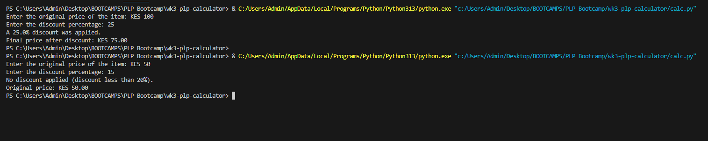

# wk3-plp-calculator
# TASK TO DO

1. Create a function named calculate_discount(price, discount_percent) that calculates the final price after applying a discount. The function should take the original price (price) and the discount percentage (discount_percent) as parameters. If the discount is 20% or higher, apply the discount; otherwise, return the original price.
    
2. Using the calculate_discount function, prompt the user to enter the original price of an item and the discount percentage. Print the final price after applying the discount, or if no discount was applied, print the original price

# Discount Calculator

A simple Python application that calculates the final price of an item after applying a discount, if applicable.

## Features

- Calculates the final price after applying a discount
- Only applies discounts of 20% or higher
- Validates user input to ensure positive numbers
- Displays appropriate messages based on whether a discount was applied

## Requirements

- Python 3.x

## Installation

1. Clone this repository or download the `calc.py` file.
2. No additional dependencies are required.

## Usage

1. Run the program:
   ```
   python calc.py
   ```

2. Follow the prompts to enter:
   - The original price of the item
   - The discount percentage

3. The program will display:
   - Whether a discount was applied
   - The final price

## Example

```
Enter the original price of the item: $100
Enter the discount percentage: 25
A 25.0% discount was applied.
Final price after discount: $75.00
```

```
Enter the original price of the item: $50
Enter the discount percentage: 15
No discount applied (discount less than 20%).
Original price: $50.00
```



## How It Works

The program includes a `calculate_discount` function that takes two parameters:
- `price`: The original price of the item
- `discount_percent`: The discount percentage

If the discount percentage is 20% or higher, the function applies the discount and returns the final price. Otherwise, it returns the original price unchanged.

## Error Handling

The program validates input to ensure that both the price and discount percentage are positive numbers. If invalid input is provided, the program will display an error message.